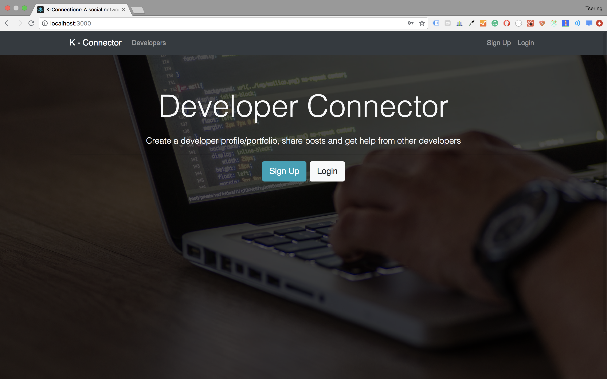
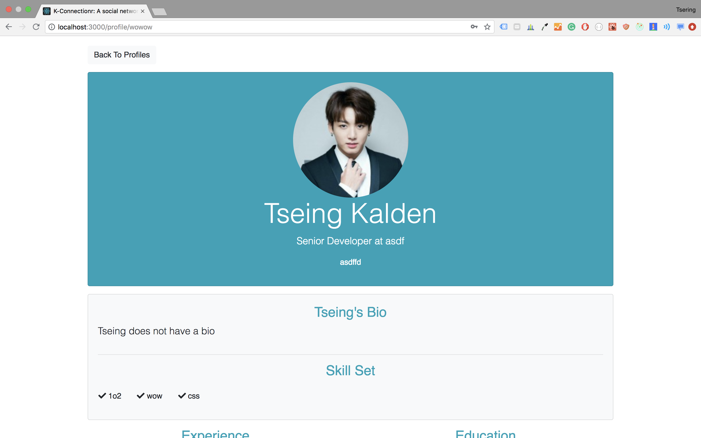
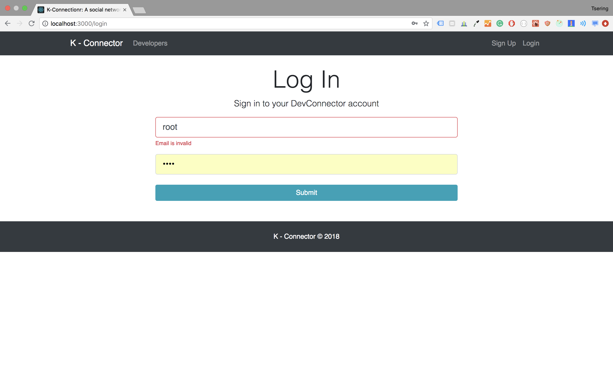
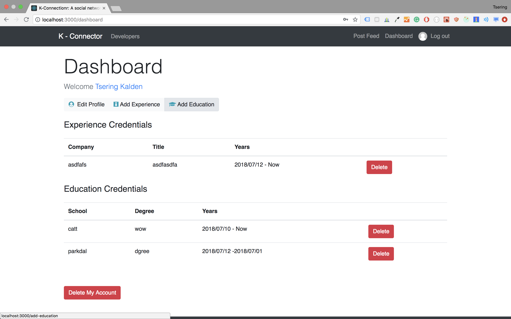
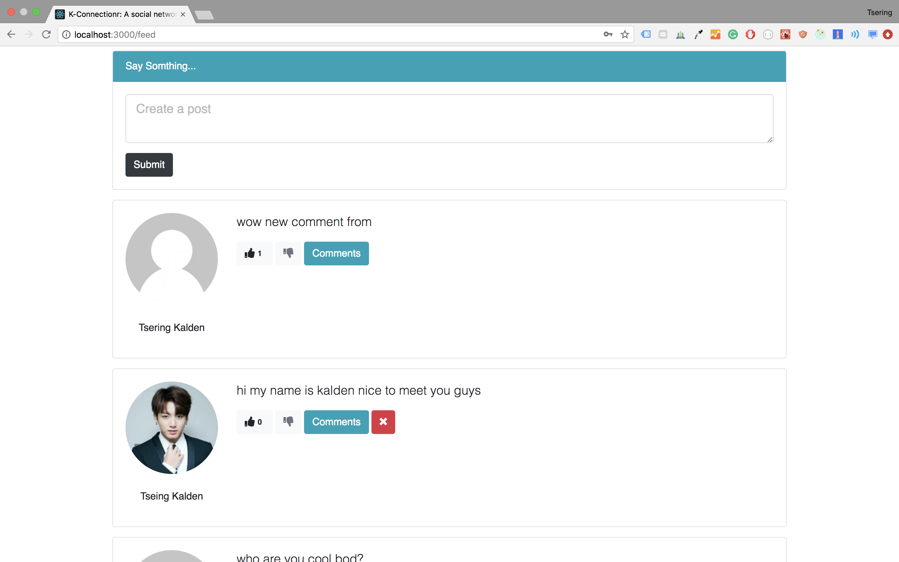

# DevConnector

> Small social network app built with the MERN stack. This is part of my "MERN Stack Front To Back" 

## Quick Start

```bash
# Install dependencies for server
npm install

# Install dependencies for client
npm run client-install

# Run the client & server with concurrently
npm run dev

# Run the Express server only
npm run server

# Run the React client only
npm run client

# Server runs on http://localhost:4000 and client on http://localhost:3000
```

You will need to create a keys_dev.js in the server config folder with

```
module.exports = {
  mongoURI: 'YOUR_OWN_MONGO_URI',
  secretOrKey: 'YOUR_OWN_SECRET'
};
```

## Heroku Launch 
> Build React on Heroku server
```
"scripts": {
   "heroku-postbuild":
      "NPM_CONFIG_PRODUCTION=false npm install --prefix client && npm run build --prefix client"
    }
```

> Express user React //server.js 
```
// path module
const path = require('path');
// Server static assets if in Production
if(process.env.NODE_ENV === 'production'){
    // Set static folder
    app.use(express.static('client/build'));

    app.get('*', (req,res) => {
        res.sendFile(path.resolve(__dirname, 'client', 'build', 'index.html'));
    });
}

```

## Screen Shot







